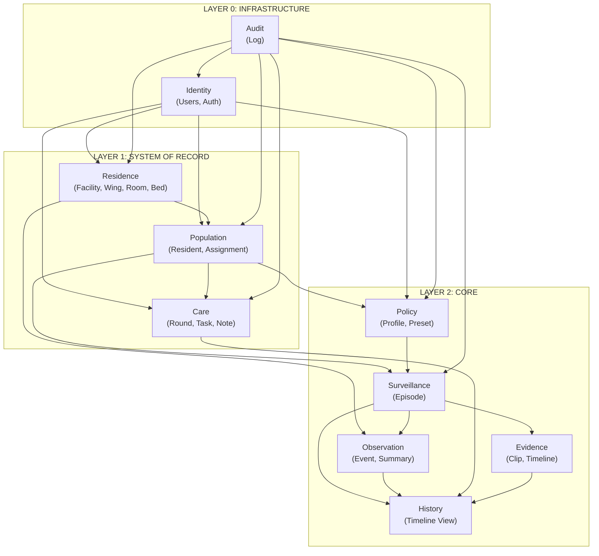

# Context Map (DDD)

## Bounded Contexts

| Context | Layer | Responsibility |
|---------|-------|----------------|
| Identity | 0 - Infrastructure | Users, authentication, RBAC |
| Audit | 0 - Infrastructure | Audit log |
| Residence | 1 - SOR | Facility hierarchy (Facility → Wing → Room → Bed) |
| Population | 1 - SOR | Residents, bed assignments |
| Care | 1 - SOR | Rounds, clinical notes |
| Policy | 2 - Core | Monitoring profiles, alarm presets |
| Surveillance | 2 - Core | Episodes (incidents requiring attention) |
| Observation | 2 - Core | Sensor events, scene changes, clinical summaries |
| Evidence | 2 - Core | Video clips, timelines |
| History | 2 - Core | Clinical timeline, incident history |

## Context Relationships

| From | To | Relationship | Type |
|------|-----|--------------|------|
| Identity | Residence | Provides users | Partner |
| Identity | Population | Provides users | Partner |
| Identity | Care | Provides users | Partner |
| Identity | Policy | Provides users | Partner |
| Residence | Population | Contains | Conformist |
| Residence | Observation | Monitors | Conformist |
| Population | Policy | Configures | Customer/Supplier |
| Population | Surveillance | Generates | Customer/Supplier |
| Population | Care | Receives | Customer/Supplier |
| Policy | Surveillance | Feeds | Customer/Supplier |
| Surveillance | Observation | Consumes | Customer/Supplier |
| Surveillance | Evidence | Generates | Customer/Supplier |
| Surveillance | History | Feeds | Customer/Supplier |
| Observation | History | Feeds | Customer/Supplier |
| Evidence | History | Feeds | Customer/Supplier |
| Care | History | Feeds | Customer/Supplier |

## Context Map Diagram

