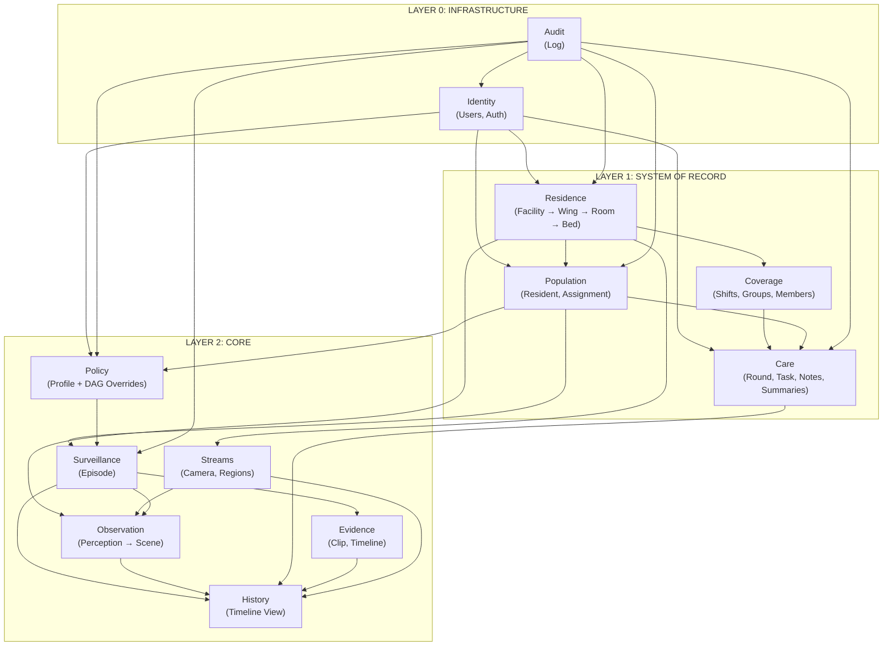

# Context Map (DDD)

## Bounded Contexts — Real (16 modules, `settings.gradle.kts:22-37`)

| Context      | Layer              | Tables                                                                                                              | Responsibility                                                     | Module              |                                              |                |
| ------------ | ------------------ | ------------------------------------------------------------------------------------------------------------------- | ------------------------------------------------------------------ | ------------------- | -------------------------------------------- | -------------- |
| Identity     | 0 - Infrastructure | `users`, `auth_sessions`                                                                                            | Users, auth (permitAll today)                                      | `identity/`         |                                              |                |
| Audit        | 0 - Infrastructure | `audit_log`                                                                                                         | Immutable trail (listens DomainEvents)                             | `audit/`            |                                              |                |
| Residence    | 1 - SOR            | `facilities`, `wings`, `rooms`, `beds`, `planogram_placements`, `room_privacy_regions`                              | Facility hierarchy Facility→Wing→Room→Bed + layout                 | `residence/`        |                                              |                |
| Population   | 1 - SOR            | `residents`, `resident_bed_assignments`                                                                             | Residents, bed assignments                                         | `population/`       |                                              |                |
| Coverage     | 1 - SOR            | `staff_groups`, `facility_shifts`, `unit_shift_coverages`, `staff_members`                                          | Shifts, coverages, staff                                           | `coverage/`         |                                              |                |
| Care         | 1 - SOR            | `rounds`, `round_tasks`, `care_notes`, `resident_notes`, `episode_notes`, `shift_notes`, `care_summaries`           | Rounds, clinical notes, findings (INSIGHT/PATTERN), care summaries | `care/`             |                                              |                |
| Policy       | 2 - Core           | `alarm_profile_versions`, `alarm_profile_overrides`                                                                 | Monitoring profiles, DAG overrides                                 | `policy/`           |                                              |                |
| Surveillance | 2 - Core           | `episodes`, `episode_transitions`, `notification_deliveries`, `notification_delivery_events`, `episode_escalations` | Episodes requiring attention                                       | `surveillance/`     |                                              |                |
| Observation  | 2 - Core           | `sensor_events`, `current_bed_states` (+`staff_present`), `scene_events`, `notification_events`, `sleep             | mobility                                                           | bathroom_summaries` | Sensor perceptions, scene changes, summaries | `observation/` |
| Evidence     | 2 - Core           | `evidence`, `timelines`, `clip_windows`                                                                             | Video clips, timelines                                             | `evidence/`         |                                              |                |
| Streams      | 2 - Core           | `streams`, `stream_regions`                                                                                         | Cameras + spatial regions                                          | `streams/`          |                                              |                |
| History      | 2 - Core           | `history_episode_detections`, `history_episode_reviews`, `history_episode_interventions`                            | Clinical timeline, normalized incidents                            | `history/`          |                                              |                |

> `shared-kernel` is not a BC — provides `Identifier`, `Entity`, `DomainEvent`. `clients` and `blueprints` are not BCs.

## Context Relationships

| From         | To                               | Relationship   | Type              | Notes                                                                   |
| ------------ | -------------------------------- | -------------- | ----------------- | ----------------------------------------------------------------------- |
| Identity     | Residence/Population/Care/Policy | Provides users | Partner           | `created_by`, `author_id` opaque refs                                   |
| Residence    | Population                       | Contains       | Conformist        | `rooms` → `beds` → `resident_bed_assignments`                           |
| Residence    | Observation                      | Monitors       | Conformist        | `beds.monitor_key` → `sensor_events.monitor_key` → `current_bed_states` |
| Residence    | Streams                          | Hosts          | Conformist        | `rooms` → `streams` → `stream_regions`                                  |
| Population   | Policy                           | Configures     | Customer/Supplier | `residents` → `alarm_profile_versions` (one current `valid_to IS NULL`) |
| Population   | Surveillance                     | Generates      | Customer/Supplier | `residents/beds` → `episodes`                                           |
| Population   | Care                             | Receives       | Customer/Supplier | `residents` → `rounds/notes`                                            |
| Coverage     | Residence                        | Covers         | Customer/Supplier | `wings` + `staff_groups` + `facility_shifts` → `unit_shift_coverages`   |
| Coverage     | Care                             | Staffs         | Customer/Supplier | `staff_members` → `history_episode_interventions.performed_by`          |
| Policy       | Surveillance                     | Feeds          | Customer/Supplier | `alarm_profile_versions/overrides` (DAG) → `EpisodeEngine` evaluation   |
| Surveillance | Observation                      | Consumes       | Customer/Supplier | `scene_events` → rule evaluation → `episodes`                           |
| Surveillance | Evidence                         | Generates      | Customer/Supplier | `episodes` → `evidence/timelines/clip_windows`                          |
| Surveillance | History                          | Feeds          | Customer/Supplier | `episodes` → `history_episode_detections.source_episode_id`             |
| Observation  | History                          | Feeds          | Customer/Supplier | `sensor_events/scene_events/summaries` → timeline                       |
| Evidence     | History                          | Feeds          | Customer/Supplier | `timelines/clip_windows` → timeline view                                |
| Care         | History                          | Feeds          | Customer/Supplier | `resident_notes` (findings), `care_summaries` → history                 |
| Streams      | Observation                      | Feeds          | Conformist        | `stream_regions` contextualize perceptions                              |

## Context Map Diagram

