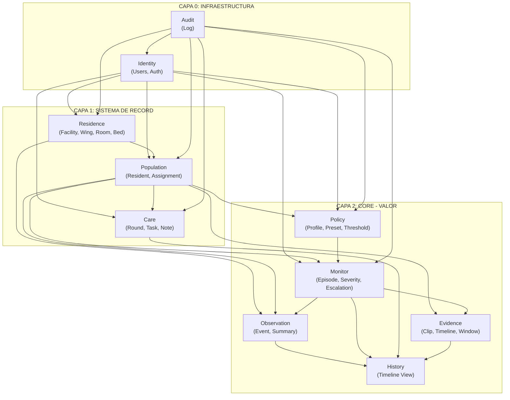

# mana-hub: Data Model (Mermaid)

> ⚠️ **Deprecated 2026-08-29:** Usa `data-model.md` como fuente de verdad (PostgreSQL 17, 44 tablas, Flyway V1-V10). Este Mermaid está desactualizado (SQLite, 34 tablas, incluye `resident_attributes` fantasma). Se mantiene por referencia histórica hasta regenerar con `data-model.md`.

## Vista General del Modelo

```mermaid
erDiagram
    %% ═══════════════════════════════════════════════════════════
    %%  CAPA 0: INFRAESTRUCTURA
    %% ═══════════════════════════════════════════════════════════

    USERS {
        uuid id PK
        string username UK
        string display_name
        string role "OWNER | STAFF | ADMIN"
        timestamp created_at
        timestamp updated_at
        bigint version
    }

    AUDIT_LOG {
        uuid id PK
        uuid actor_id FK
        string action
        string entity_type
        uuid entity_id
        jsonb payload
        timestamp created_at
    }

    %% ═══════════════════════════════════════════════════════════
    %%  CAPA 1: SISTEMA DE RECORD (Master Data)
    %% ═══════════════════════════════════════════════════════════

    FACILITIES {
        uuid id PK
        string name
        string timezone
        timestamp created_at
        timestamp updated_at
        bigint version
    }

    WINGS {
        uuid id PK
        uuid facility_id FK
        string name
        string floor
        timestamp created_at
        timestamp updated_at
        bigint version
    }

    ROOMS {
        uuid id PK
        uuid wing_id FK
        string number
        string type "STANDARD | ICU | ISOLATION"
        timestamp created_at
        timestamp updated_at
        bigint version
    }

    BEDS {
        uuid id PK
        uuid room_id FK
        string label
        string status "AVAILABLE | OCCUPIED | MAINTENANCE"
        timestamp created_at
        timestamp updated_at
        bigint version
    }

    RESIDENTS {
        uuid id PK
        string full_name
        date birth_date
        date admission_date
        string status "ACTIVE | INACTIVE | DECEASED"
        jsonb medical_record_number
        timestamp created_at
        timestamp updated_at
        bigint version
    }

    RESIDENT_BED_ASSIGNMENTS {
        uuid id PK
        uuid resident_id FK
        uuid bed_id FK
        date assigned_at
        date released_at
        boolean is_current
        timestamp created_at
        timestamp updated_at
        bigint version
    }

    STREAMS {
        uuid id PK
        uuid room_id FK
        string stream_key
        string name
        string status "ACTIVE | INACTIVE | ERROR"
        timestamp created_at
        timestamp updated_at
        bigint version
    }

    STREAM_REGIONS {
        uuid id PK
        uuid stream_id FK
        string label
        string points
        string region_type "BED | HALLWAY | BATHROOM | EXIT"
        timestamp created_at
        timestamp updated_at
        bigint version
    }

    %% ═══════════════════════════════════════════════════════════
    %%  CAPA 2: CORE - MONITOREO
    %% ═══════════════════════════════════════════════════════════

    ALARM_PROFILES {
        uuid id PK
        uuid resident_id FK
        timestamp valid_from
        timestamp valid_to
        string mobility_aid "WHEELCHAIR | WALKER | NONE"
        boolean autopilot
        string mode
        string template_id FK
        jsonb overrides_json
        string risk_level "LOW | MEDIUM | HIGH"
        string updated_by FK
        timestamp created_at
        timestamp updated_at
        bigint version
    }

    ALARM_PRESETS {
        string id PK
        string name
        string description
        jsonb thresholds
        boolean is_default
        timestamp created_at
        timestamp updated_at
        bigint version
    }

    ALERTS {
        uuid id PK
        uuid resident_id FK
        uuid bed_id FK
        string level "INFO | WARNING | CRITICAL | EMERGENCY"
        string status "PENDING | ACKNOWLEDGED | RESOLVED | DISMISSED"
        string title
        text detail
        timestamp occurred_at
        int escalation_level
        string evidence_kind
        string evidence_ref
        timestamp created_at
        timestamp updated_at
        bigint version
    }

    %% ═══════════════════════════════════════════════════════════
    %%  CAPA 2: CORE - HISTORIA
    %% ═══════════════════════════════════════════════════════════

    SENSOR_EVENTS {
        uuid id PK
        uuid room_id FK
        uuid stream_id FK
        string monitor_key
        string kind
        string state
        boolean sleeping
        uuid resident_id FK
        timestamp created_at
        timestamp updated_at
        bigint version
    }

    CURRENT_BED_STATES {
        uuid id PK
        uuid bed_id FK
        uuid resident_id FK
        string state "IN_BED | OUT_OF_BED | SLEEPING | AWAKE"
        timestamp last_transition_at
        timestamp created_at
        timestamp updated_at
        bigint version
    }

    SCENE_EVENTS {
        uuid id PK
        uuid room_id FK
        uuid stream_id FK
        string monitor_key
        string from_state
        string to_state
        uuid resident_id FK
        timestamp created_at
        timestamp updated_at
        bigint version
    }

    SLEEP_SUMMARIES {
        uuid id PK
        uuid resident_id FK
        date summary_date
        int calm_minutes
        int restless_minutes
        int awake_minutes
        int out_of_bed_minutes
        int bed_exit_count
        int wake_count
        timestamp created_at
        timestamp updated_at
        bigint version
    }

    MOBILITY_SUMMARIES {
        uuid id PK
        uuid resident_id FK
        date summary_date
        int walking_minutes
        decimal distance_meters
        int transfer_count
        timestamp created_at
        timestamp updated_at
        bigint version
    }

    BATHROOM_SUMMARIES {
        uuid id PK
        uuid resident_id FK
        date summary_date
        int visit_count
        int night_visit_count
        timestamp created_at
        timestamp updated_at
        bigint version
    }

    %% ═══════════════════════════════════════════════════════════
    %%  CAPA 2: CORE - EVIDENCIA
    %% ═══════════════════════════════════════════════════════════

    EVIDENCE {
        uuid id PK
        uuid bed_id FK
        uuid resident_id FK
        string evidence_kind "VIDEO_CLIP | IMAGE | AUDIO | DOCUMENT"
        string source
        string storage_path
        timestamp created_at
        timestamp updated_at
        bigint version
    }

    TIMELINES {
        uuid id PK
        uuid bed_id FK
        uuid resident_id FK
        string status "OPEN | CLOSED"
        timestamp started_at
        timestamp ended_at
        timestamp created_at
        timestamp updated_at
        bigint version
    }

    CLIP_WINDOWS {
        uuid window_id PK
        uuid bed_id FK
        uuid resident_id FK
        timestamp window_start
        timestamp window_end
        string status "OPEN | CLOSED"
        timestamp created_at
        timestamp updated_at
        bigint version
    }

    %% ═══════════════════════════════════════════════════════════
    %%  CAPA 1: SISTEMA DE RECORD - CUIDADO
    %% ═══════════════════════════════════════════════════════════

    ROUNDS {
        uuid id PK
        uuid resident_id FK
        uuid assigned_to FK
        string scheduled_at
        string status "PENDING | IN_PROGRESS | COMPLETED | SKIPPED"
        timestamp created_at
        timestamp updated_at
        bigint version
    }

    ROUND_TASKS {
        uuid id PK
        uuid round_id FK
        string task_type "BP_CHECK | WEIGHT | MEDICATION | WOUND_CARE | CUSTOM"
        string description
        string status "PENDING | COMPLETED | SKIPPED"
        text note
        timestamp completed_at
        timestamp created_at
        timestamp updated_at
        bigint version
    }

    CARE_NOTES {
        uuid id PK
        uuid resident_id FK
        uuid round_id FK
        uuid author_id FK
        string note_type "CLINICAL | OBSERVATION | INCIDENT"
        text content
        timestamp created_at
        timestamp updated_at
        bigint version
    }

    %% ═══════════════════════════════════════════════════════════
    %%  RELACIONES
    %% ═══════════════════════════════════════════════════════════

    %% Infraestructura
    USERS ||--o{ AUDIT_LOG : "creates"

    %% Residence
    FACILITIES ||--|{ WINGS : "contains"
    WINGS ||--|{ ROOMS : "contains"
    ROOMS ||--|{ BEDS : "contains"
    ROOMS ||--o{ STREAMS : "has"

    %% Population
    RESIDENTS ||--o{ RESIDENT_BED_ASSIGNMENTS : "assigned to"
    BEDS ||--o{ RESIDENT_BED_ASSIGNMENTS : "occupied by"
    BEDS ||--o{ CURRENT_BED_STATES : "tracked in"

    %% Streams
    STREAMS ||--|{ STREAM_REGIONS : "defines"

    %% Policy
    RESIDENTS ||--o{ ALARM_PROFILES : "has"
    ALARM_PRESETS ||--o{ ALARM_PROFILES : "template for"

    %% Surveillance
    RESIDENTS ||--o{ EPISODES : "generates"
    BEDS ||--o{ EPISODES : "occurs in"

    %% Observation
    STREAMS ||--o{ SENSOR_EVENTS : "captures"
    ROOMS ||--o{ SENSOR_EVENTS : "in room"
    RESIDENTS ||--o{ SENSOR_EVENTS : "involves"
    RESIDENTS ||--o{ SLEEP_SUMMARIES : "daily"
    RESIDENTS ||--o{ MOBILITY_SUMMARIES : "daily"
    RESIDENTS ||--o{ BATHROOM_SUMMARIES : "daily"
    RESIDENTS ||--o{ SCENE_EVENTS : "transitions"
    BEDS ||--o{ SCENE_EVENTS : "at bed"

    %% Evidence
    RESIDENTS ||--o{ EVIDENCE : "has"
    BEDS ||--o{ EVIDENCE : "from"
    RESIDENTS ||--o{ TIMELINES : "tracked"
    BEDS ||--o{ TIMELINES : "at"
    RESIDENTS ||--o{ CLIP_WINDOWS : "captured"
    BEDS ||--o{ CLIP_WINDOWS : "at"

    %% Care
    RESIDENTS ||--o{ ROUNDS : "receives"
    USERS ||--o{ ROUNDS : "assigned"
    ROUNDS ||--|{ ROUND_TASKS : "contains"
    RESIDENTS ||--o{ CARE_NOTES : "about"
    USERS ||--o{ CARE_NOTES : "writes"
    ROUNDS ||--o{ CARE_NOTES : "documents"
```

---

## Vista por Bounded Context

### Context Map

---

## Entidades Clave por Context

### Policy (Core)
| Entidad | Descripción | Relación |
|---------|-------------|----------|
| `AlarmPreset` | Plantilla de reglas de monitoreo | Feed → Monitor |
| `AlarmProfile` | Configuración por residente | Feed → Monitor |
| `Threshold` | Umbral de alerta | Parte de Preset |

### Monitor (Core)
| Entidad | Descripción | Relación |
|---------|-------------|----------|
| `Episode` | Algo pasó que requiere atención | Recibe de Policy |
| `EpisodeSeverity` | Severidad (INFO/WARNING/CRITICAL/EMERGENCY) | Propiedad de Episode |
| `Escalation` | Nivel de escalamiento | Propiedad de Episode |

### Observation (Core)
| Entidad | Descripción | Relación |
|---------|-------------|----------|
| `SensorEvent` | Evento crudo de cámara/sensor | Alimenta → Monitor |
| `SleepSummary` | Resumen diario de sueño | Alimenta → History |
| `MobilitySummary` | Resumen diario de movilidad | Alimenta → History |
| `BathroomSummary` | Resumen diario de baño | Alimenta → History |

### History (Core)
| Entidad | Descripción | Recibe de |
|---------|-------------|-----------|
| `ClinicalTimeline` | Vista unificada de todo | Todos los contexts |
