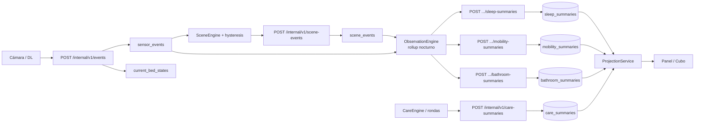

# Memoria técnica — Summaries, ficha del residente e hidratador del cubo

> **Audiencia:** equipo que implementará el **hidratador del cubo analítico** (OLAP / warehouse) y consumidores de la **ficha del residente** (panel).  
> **Fecha:** 2026-08-31  
> **Fuentes de verdad en repo:** `data-model.md`, `api.md`, `docs/big-picture/data-flow.md`, `bootstrap/.../views/ProjectionService.kt`, `observation/.../EventIngestionService.kt`

---

## 1. Principio rector — mana-hub como System of Record

```
┌─────────────────────────────┐     ┌─────────────────────────────┐
│  EXTERNO (computa)          │     │  MANA-HUB (recuerda)        │
│  ObservationEngine          │────▶│  sleep|mobility|bathroom_   │
│  SceneEngine                │     │  summaries                  │
│  CareEngine                 │────▶│  care_summaries             │
│  EpisodeEngine / ML         │────▶│  history_episode_*          │
└─────────────────────────────┘     └─────────────────────────────┘
                                              │
                                              ▼
                                    ┌─────────────────────────────┐
                                    │  PANEL / CUBO (interpreta)  │
                                    │  KPIs, baseline, gráficos   │
                                    └─────────────────────────────┘
```

**mana-hub no calcula** resúmenes clínicos diarios en runtime. **Persiste** lo que llega por `POST /internal/v1/clinical/*` (y `care-summaries`).  
**El panel** y el **cubo** pueden **re-calcular** agregados a partir de filas diarias o, en el cubo, a partir de **`scene_events`** + **`sensor_events`** si se quiere recomputar histórico.

---

## 2. Ficha del residente — mapa de tabs

La ficha (`ResidentChart`) es una **vista compuesta** del panel. Cada tab lee proyecciones bajo `/api/v1/views/...`.

| Tab panel | Endpoint proyección | Tabla(s) SOR | ¿Agregados en hub? |
|-----------|---------------------|--------------|-------------------|
| Cabecera (nombre, Hab., estado vivo) | `GET /api/v1/views/resident-chart/{id}` | `residents`, `resident_bed_assignments`, `beds/rooms/wings`, `current_bed_states` | No — estado puntual |
| Alarmas | `GET/PATCH .../alarm-presets` | `alarm_profile_versions`, `alarm_profile_overrides` | No |
| Sueño | `GET .../sleep?from=&to=` | `sleep_summaries` | No — lista cruda por noche |
| Movilidad | `GET .../mobility?from=&to=` | `mobility_summaries` | No — lista cruda (4/6 campos) |
| Baño | `GET .../bathroom?from=&to=` | `bathroom_summaries` | No — lista cruda (2/4 campos) |
| Cuidado | `GET .../care?from=&to=` | `care_summaries` | **Sí** — `avgMinutesPerDay`, `proactiveShare`; **días sin fila → ceros** (zero-fill en proyección) |
| Caídas | `GET .../falls?months=12` | `history_episode_detections` (+ reviews) | **Sí** — streak, buckets mensuales |
| Episodios | `GET .../episodes` | `history_episode_detections` | Parcial — lista enriquecida |

**Ventana típica del panel:** 14 días (`from = hoy - 13`, `to = hoy`). Default idéntico en `ObservationController` para rutas `/api/v1/residents/{id}/sleep|mobility|bathroom|care`.

---

## 3. Cadena canónica de eventos → summaries



### Granularidad temporal

| Capa | Granularidad | Clave natural |
|------|--------------|---------------|
| `sensor_events` | evento (~segundos) | `source_event_id` UNIQUE |
| `scene_events` | transición / permanencia confirmada | `event_id` UNIQUE |
| `*_summaries` | **1 fila / residente / día** | `(resident_id, observed_on)` UNIQUE |
| Proyección panel | rango de días | query `from`..`to` |
| KPIs panel | ventana 7d / 14d / vs semana previa | **calculado en cliente** (sueño/mov/baño) |

---

## 4. Tablas summary — esquema completo

### 4.1 `sleep_summaries`

| Columna | Tipo | Ingesta | GET chart | Uso típico panel |
|---------|------|---------|-----------|------------------|
| `source_record_id` | TEXT UNIQUE | ✅ | — | Idempotencia hidratador |
| `resident_id` | TEXT | ✅ | ✅ | Dimensión cubo |
| `observed_on` | DATE | ✅ | `day` | Dimensión fecha |
| `calm_minutes` | INT | ✅ | ✅ | Dormido / promedio 7d |
| `restless_minutes` | INT | ✅ | ✅ | Inquieto / % |
| `awake_minutes` | INT | ✅ | ✅ | Despierto en cama |
| `out_of_bed_minutes` | INT | ✅ | ✅ | Fuera de cama (noche) |
| `bed_exit_count` | INT | ✅ | ✅ | Puntos ventana sueño |
| `wake_count` | INT | ✅ | ✅ | Despertares |
| `started_at` | TIMESTAMP (V8) | ✅ | ✅ | Ventana sueño (inicio) |
| `ended_at` | TIMESTAMP (V8) | ✅ | ✅ | Ventana sueño (fin) |
| `source`, `model_version`, `confidence` | meta | ✅ | ❌ | Linaje cubo |
| `provenance_json` | TEXT | ❌ en DTO Kotlin | ❌ | Extensión futura |

**KPIs panel derivados (no en DB):** promedio calm 7d, Δ vs semana anterior, eficiencia %, texto baseline, mediana horario habitual.

### 4.2 `mobility_summaries`

| Columna | Ingesta | GET chart | Notas |
|---------|---------|-----------|-------|
| `in_bed_minutes` | ✅ | ❌ | Persistido; **no expuesto** en proyección |
| `out_of_bed_minutes` | ✅ | ✅ | |
| `out_of_sight_minutes` | ✅ | ❌ | Persistido; **no expuesto** |
| `walking_minutes` | ✅ | ✅ | |
| `distance_meters` | ✅ | ✅ | |
| `transfer_count` | ✅ | ✅ | |

**Origen conceptual (motor externo):** suma de *dwell time* por estado a partir de `scene_events` (ver §6).

### 4.3 `bathroom_summaries`

| Columna | Ingesta | GET chart |
|---------|---------|-----------|
| `visit_count` | ✅ | ✅ |
| `night_visit_count` | ✅ | ✅ |
| `assisted_count` | ✅ | ❌ |
| `total_minutes` | ✅ | ❌ |

**Origen conceptual:** conteo de permanencias en zona baño / transiciones `→ bathroom` en `scene_events` (reglas del motor).

### 4.4 `care_summaries`

| Columna | Ingesta | GET chart |
|---------|---------|-----------|
| `total_minutes` | ✅ | ✅ |
| `proactive_minutes` | ✅ | ✅ |
| `rounds_count` | ✅ | ✅ |
| `notes_count` | ✅ | ✅ |

**Origen:** `CareEngine` agrega rondas (`rounds`, `round_tasks`) y notas (`care_notes`, etc.). **No se deriva de `scene_events`.**

---

## 5. Contratos API

### 5.1 Ingesta (M2M) — envelope común

```json
{
  "sourceRecordId": "cube-jose-2026-08-30-sleep",
  "residentId": "jose",
  "observedOn": "2026-08-30",
  "source": "cube-hydrator",
  "modelVersion": "1.0.0",
  "confidence": 0.95,
  "data": { /* SleepSummaryData | MobilitySummaryData | BathroomSummaryData */ }
}
```

| Summary | POST |
|---------|------|
| Sueño | `/internal/v1/clinical/sleep-summaries` |
| Movilidad | `/internal/v1/clinical/mobility-summaries` |
| Baño | `/internal/v1/clinical/bathroom-summaries` |
| Cuidado | `/internal/v1/care-summaries` |

**Idempotencia:** `source_record_id` UNIQUE por tabla. Re-ingesta mismo día → error 500 hoy (sin upsert).  
**Recomendación hidratador:** `sourceRecordId = "{jobId}-{residentId}-{observedOn}-{kind}"` determinístico; antes de POST, consultar GET rango o usar DELETE admin si reprocess.

### 5.2 Lectura panel — dos rutas equivalentes (deuda)

| Proyección chart | Alternativa observation |
|------------------|-------------------------|
| `GET /api/v1/views/resident-chart/{id}/sleep` | `GET /api/v1/residents/{id}/sleep` |
| `.../mobility` | `.../mobility` |
| `.../bathroom` | `.../bathroom` |
| `.../care` | `GET /api/v1/residents/{id}/care` |

DTO chart usa `day`; observation usa `observedOn`. Mismos números, distinto nombre de campo.

### 5.3 Lectura de eventos (input del hidratador)

| Recurso | GET | Uso cubo |
|---------|-----|----------|
| Escenas | `GET /api/v1/residents/{id}/scene-events` | Reconstruir timeline por estado |
| Percepciones | (stub parcial) | Micro-estados pre-hysteresis |
| Estado vivo | `GET /api/v1/residents/{id}/current-state` | No histórico |
| Summaries ya materializados | `GET .../sleep?from=&to=` | **Fast path** — hidratar cubo sin recomputar |

---

## 6. `scene_events` — schema y relación con summaries

### 6.1 Columnas relevantes

```sql
-- V1 + V15
scene_events (
  event_id       TEXT UNIQUE,      -- idempotencia
  bed_id         TEXT,
  resident_id    TEXT,
  event_type     TEXT,             -- TRANSITION | PERMANENCE | ...
  from_state     TEXT,
  to_state       TEXT,
  trigger_type   TEXT,             -- HYSTERESIS | PERMANENCE | MANUAL
  timestamp      TIMESTAMP,
  payload_json   TEXT,
  twin_snapshot  JSONB,            -- V15: stateSince, sceneSince, signalLost, monitor
  state_since    TIMESTAMP,
  scene_since    TIMESTAMP,
  signal_lost    BOOLEAN,
  monitor_id     TEXT
)
```

### 6.2 Estados canónicos (catálogo)

`GET /api/v1/catalog/states` — ej.: `lying`, `sitting_in_bed`, `standing`, `walking`, `out_of_bed`, `out_of_sight`, …

### 6.3 Mapeo conceptual scene → summary (lógica del **motor externo**, referencia para cubo)

El hidratador puede replicar esta lógica offline:

#### Movilidad (por `observed_on` = fecha calendario facility TZ)

```
Para cada intervalo [t_i, t_{i+1}) entre scene_events ordenados por timestamp:
  state = toState del evento en t_i (o fromState si permanencia)
  duración_min = minutes(t_{i+1} - t_i)

  acumular:
    in_bed_minutes       += duración si state ∈ {lying, sitting_in_bed, ...}
    out_of_bed_minutes   += duración si state ∈ {standing, sitting, ...} ∩ visible
    out_of_sight_minutes += duración si state = out_of_sight
    walking_minutes      += duración si state = walking
    transfer_count       += 1 en cada TRANSITION que cruce umbral cama↔pie
    distance_meters      += estimación trayectoria (si hay payload geométrico)
```

#### Sueño (ventana nocturna — típicamente 19:00→12:00 día siguiente en TZ residencia)

```
Filtrar scene_events + sensor sleeping flag en ventana nocturna
  calm_minutes      = tiempo sleeping=true ∧ micro-movimiento bajo
  restless_minutes  = sleeping=true ∧ micro-movimiento alto
  awake_minutes     = en cama ∧ ¬sleeping
  out_of_bed_minutes, bed_exit_count, wake_count = transiciones salida/entrada cama
  started_at        = primer timestamp in-bed en ventana
  ended_at          = último timestamp in-bed en ventana
```

> **Nota:** mana-hub **no implementa** estas fórmulas. Son contrato del ObservationEngine. El cubo puede: (a) consumir summaries ya materializados, o (b) recomputar desde `scene_events` con la misma semántica y comparar con SOR.

#### Baño

```
visit_count       = count(PERMANENCE donde to_state = bathroom ∨ zone=baño)
night_visit_count = subset en franja 22:00–06:00
assisted_count    = visitas con staff_present=true en intervalo
total_minutes     = sum(dwell) en baño
```

---

## 7. Capas de computación — quién calcula qué

| Métrica | ¿En DB? | ¿En API chart? | ¿Quién calcula? |
|---------|---------|----------------|-----------------|
| calm_minutes / noche | ✅ | ✅ | Motor → SOR |
| Promedio 7h16 sueño | ❌ | ❌ | Panel (avg calm 7d) |
| Eficiencia 95% | ❌ | ❌ | Panel |
| walking_minutes / día | ✅ | ✅ | Motor → SOR |
| in_bed_minutes / día | ✅ | ❌ | Motor → SOR (gap lectura) |
| avgMinutesPerDay cuidado | ❌ | ✅ | **Hub** ProjectionService |
| streakDays caídas | ❌ | ✅ | **Hub** ProjectionService |

---

## 8. Proceso propuesto — hidratador del cubo

### 8.1 Modos de operación

| Modo | Input | Output | Cuándo |
|------|-------|--------|--------|
| **A — Mirror SOR** | GET summaries rango | Facts en cubo | Panel parity, dashboards rápidos |
| **B — Recompute** | GET scene_events (+ sensor) | Facts + POST summaries | Backfill, auditoría, nuevo algoritmo |
| **C — Híbrido** | Mirror + diff vs recompute | Alertas calidad datos | CI del motor |

### 8.2 Pipeline batch (modo B — recomendado para backfill)

```
1. DIM_RESIDENT     ← GET residents + bed assignment + wing/room
2. DIM_DATE         ← calendario facility (TZ America/Argentina/Buenos_Aires)
3. EXTRACT          ← GET /residents/{id}/scene-events?from=&to=
                     (paginar si se agrega filtro temporal en API)
4. TRANSFORM        ← ordenar por timestamp, reconstruir intervalos
                     ← aplicar reglas §6.3 por observed_on
5. LOAD facts       ← cubo: fact_sleep, fact_mobility, fact_bathroom
6. OPTIONAL PUSH    ← POST /internal/v1/clinical/* si cubo es source of recomputed truth
7. LINEAGE          ← guardar sourceRecordId, modelVersion, count(scene_events)
```

### 8.3 Pipeline incremental (near real-time)

```
Stream scene_events (poll GET con cursor timestamp / event_id)
  → ventana rodante por residente
  → al cierre de día local (06:00 job):
       finalize observed_on = D
       POST summaries para D
       upsert facts cubo partición D
```

### 8.4 Claves del cubo (modelo dimensional sugerido)

**Dimensiones**
- `dim_resident` (id, full_name, wing, room, bed, admission_date)
- `dim_date` (date, dow, is_weekend)
- `dim_alarm_profile` (risk_level, mobility_aid) — snapshot diario

**Hechos (grain: resident × day)**
- `fact_sleep` — columnas = sleep_summaries
- `fact_mobility` — **incluir in_bed y out_of_sight** aunque chart no los exponga
- `fact_bathroom` — **incluir assisted_count, total_minutes**
- `fact_care` — care_summaries
- `fact_falls` — degenerate from history_episode_detections (event grain opcional)

**Métricas derivadas cubo (equivalente panel)**
- `avg_calm_7d`, `delta_calm_wow`, `restless_pct`, `sleep_efficiency` — calcular en cubo/BI, no en SOR

### 8.5 Pseudocódigo — intervalos desde scene_events

```python
def build_intervals(events: list[SceneEvent], day_end: datetime) -> list[Interval]:
    events = sorted(events, key=lambda e: e.timestamp)
    intervals = []
    for i, ev in enumerate(events):
        start = ev.timestamp
        end = events[i + 1].timestamp if i + 1 < len(events) else day_end
        state = ev.to_state or ev.from_state
        intervals.append(Interval(start, end, state, ev.event_type))
    return intervals

def rollup_mobility(intervals: list[Interval]) -> MobilitySummaryData:
    in_bed = out_of_bed = out_of_sight = walking = 0
    transfers = 0
    for iv in intervals:
        mins = (iv.end - iv.start).total_seconds() / 60
        if iv.state in IN_BED_STATES:
            in_bed += mins
        elif iv.state == "out_of_sight":
            out_of_sight += mins
        elif iv.state == "walking":
            walking += mins
            out_of_bed += mins
        elif iv.state in OUT_OF_BED_VISIBLE:
            out_of_bed += mins
        if iv.event_type == "TRANSITION" and crosses_transfer(iv):
            transfers += 1
    return MobilitySummaryData(...)
```

---

## 9. Gaps y deuda conocida (impacto cubo)

| # | Gap | Impacto | Mitigación |
|---|-----|---------|------------|
| 1 | Campos mobility/bathroom no expuestos en GET chart | Cubo debe leer DB directo o ampliar DTO | Extender `MobilityDayProjection` / `BathroomDayProjection` |
| 2 | Sin upsert en ingesta summary | Reprocess falla | Upsert por `(resident_id, observed_on)` o DELETE+POST |
| 3 | Dos rutas GET duplicadas | Confusión contrato | Canonical: `/views/resident-chart/...` para panel |
| 4 | `GET scene-events` sin filtro `from/to` documentado | Extract ineficiente | Añadir query params o export batch |
| 5 | KPIs sueño solo en panel | Cubo debe reimplementar fórmulas | Documentar fórmulas panel en repo BI |
| 6 | `care_summaries` no viene de escenas | No mezclar pipelines | Job separado CareEngine |

---

## 10. Referencias código

| Artefacto | Path |
|-----------|------|
| Ingesta summaries | `observation/.../EventIngestionController.kt` |
| Persistencia | `observation/.../EventIngestionService.kt` |
| Proyecciones ficha | `bootstrap/.../views/ProjectionService.kt` |
| DTOs chart | `bootstrap/.../views/ProjectionDtos.kt` |
| DDL summaries | `bootstrap/.../db/migration/V1__init.sql`, `V7__care_summaries.sql`, `V8__...` |
| Scene V15 | `bootstrap/.../db/migration/V15__twin_snapshot_on_scene_events.sql` |
| Seed demo José | `scripts/seed/scenarios/demo_panel.py`, `scripts/mana_sdk/wellbeing.py` |
| DSL ingesta | `clients/.../observation/ObservationContext.kt` |

---

## 11. Checklist implementación hidratador

- [ ] Definir TZ observación (`facilities.timezone` → `observed_on`)
- [ ] Elegir modo A (mirror) vs B (recompute) por entorno
- [ ] Implementar `sourceRecordId` determinístico
- [ ] Mapear **todos** los campos DB (incl. no expuestos en chart)
- [ ] Job cierre diario alineado con ciclo 06:00 (`data-flow.md` Full Day Cycle)
- [ ] Validación: diff recomputed vs SOR < umbral
- [ ] Métricas derivadas panel en capa cubo/BI, no en mana-hub
- [ ] Documentar fórmulas panel cuando se conozcan del frontend

---

*Este documento complementa `docs/big-picture/data-flow.md` con foco en summaries + ficha + cubo. Actualizar cuando se expongan campos faltantes en proyección o se agregue upsert.*
